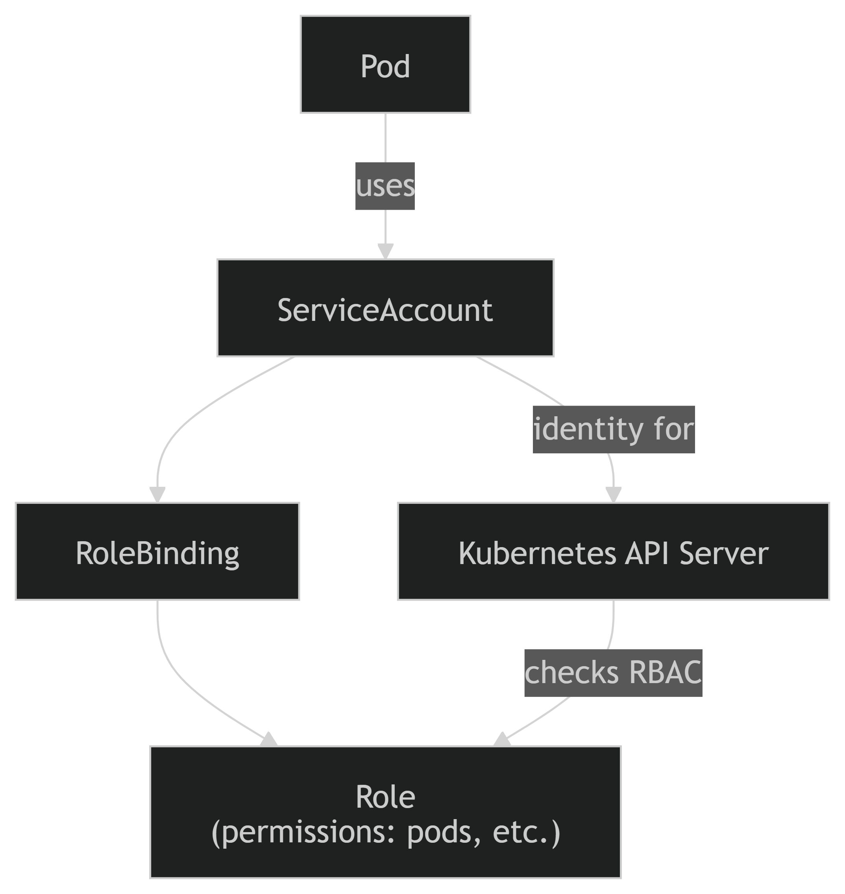

# Kubernetes RBAC Mini Project Documentation

This document provides a clear understanding of the **Kubernetes RBAC (Role-Based Access Control)** concept, specifically focusing on how **pods access cluster resources**.

---

# 🔐 1. Required Resources for RBAC

To allow a pod to access Kubernetes resources, the following components are required:

## ✅ Deployment
- Creates and manages pods
- The pod runs with permissions via a ServiceAccount

## ✅ ServiceAccount
- Acts as the **identity of the pod**
- Used for authentication with the API server

## ✅ Role
- Defines **permissions (rules)** for accessing resources
- Scoped to a **specific namespace**

## ✅ RoleBinding
- Connects the **Role** to the **ServiceAccount**
- Grants the defined permissions to the identity

## ✅ ClusterRole
- Similar to Role, but:
  - Applies to **cluster-wide resources**
  - Not limited to a namespace

---

# 🔗 2. Resource Relationships

The connection between the components is as follows:

## ServiceAccount in Deployment
The service account details is mentioned in the pod template inside the deployment yaml.
```yaml
spec:
  serviceAccountName: demo-sa
```

## Role Creation
Role is created with the requied permissions.
```yaml
rules:
- resources: ["pods"]
  verbs: ["get", "list", "watch"]
```

## RoleBinding Connection

RoleBinding links:
- ServiceAccount (identity)
- Role (permissions)

## ClusterRoleBinding

Same process as RoleBinding, but links:
- ServiceAccount
- ClusterRole (cluster-wide permissions)



---

# 🔑 3. Authentication Process

This explains **how a pod is authenticated** when making requests.

## Credential Injection

When a pod is created, Kubernetes automatically injects:

```
/var/run/secrets/kubernetes.io/serviceaccount/
```

Contains:
- `token` → JWT token (used for authentication)
- `ca.crt` → Cluster certificate
- `namespace` → Pod namespace

## Request Flow

When a command is run inside the pod:

```bash
kubectl get pods
```

The request:
- Goes to Kubernetes API server
- Includes the JWT token

Example payload:

```json
{
  "iss": "kubernetes/serviceaccount",
  "kubernetes.io/serviceaccount/name": "demo-sa",
  "kubernetes.io/serviceaccount/namespace": "rbac-demo",
  "sub": "system:serviceaccount:rbac-demo:demo-sa"
}
```

## Token Validation

The API server validates the request by:
- Verifying the **JWT signature** using its public key
- Ensuring token validity, issuer, and expiry

## Authorization (RBAC)

After authentication:
- API server checks:
  - RoleBindings
  - ClusterRoleBindings

Determines whether the action is allowed or denied

---

# ✅ 4. Validation Steps

## Access the Pod

```bash
kubectl exec -n rbac-demo -it <pod-name> -- sh
```

## Test Namespace-Level Access

```bash
kubectl get pods -n rbac-demo   # ✅ Allowed
kubectl get pods -n default     # ❌ Denied
```

## Test Cluster-Level Access

```bash
kubectl get nodes               # ✅ Allowed
kubectl run test --image=nginx  # ❌ Denied
```

## Check Permissions

```bash
kubectl auth can-i --as=system:serviceaccount:rbac-demo:demo-sa list pods -n rbac-demo
```


The above image shows, logging into the pod and running commands. First we can see the pod of rbac-demo can be accessed but not of nitrogen. 
Then we see that we can't access the nodes of the cluster, because I hadn't created the clusterRole for it, but after creation we can see that we can acess the nodes now.
We can also see the files present in the service account folder, the token, ns and ca.crt.

---


# 🧠 Key Takeaways

- ServiceAccount provides **identity**
- Token is automatically injected into pods
- API server authenticates using JWT
- RBAC controls authorization via roles and bindings
- Permissions are granted, not embedded in ServiceAccount

---

# 🚀 Summary Flow

```
Pod → ServiceAccount Token → API Server
        ↓
 Authentication (JWT validation)
        ↓
 Authorization (RBAC check)
        ↓
 Access Granted / Denied
```
