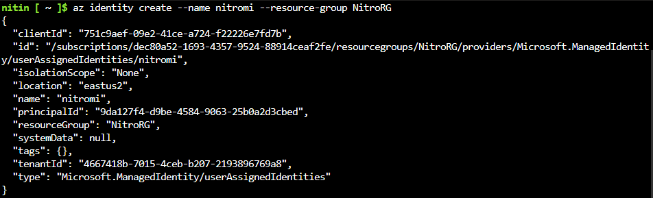
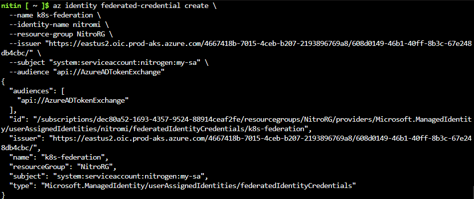

# Azure Workload Identity + CSI Secrets Store Flow (AKS)

## 🧠 Overview
This document explains how Azure Workload Identity, Kubernetes ServiceAccounts, and the Secrets Store CSI Driver work together to fetch and mount secrets from Azure Key Vault.

---

## 🔑 Core Components

- **Pod** – Runs your application
- **ServiceAccount (SA)** – Provides identity inside Kubernetes
- **Workload Identity Webhook** – Injects Azure identity configuration
- **Federated Token** – Identity proof used for Azure authentication
- **Azure AD (Entra ID)** – Issues Azure access tokens
- **Secrets Store CSI Driver** – Mounts secrets into pods
- **Azure Key Vault Provider** – Fetches secrets from Key Vault
- **SecretProviderClass (SPC)** – Defines what secrets to fetch

---

## 🔐 Token Types Explained

| Token | Issuer | Purpose |
|------|--------|--------|
| ServiceAccount Token | Kubernetes | Access Kubernetes API |
| Federated Token | Kubernetes | Used for Azure token exchange |
| Azure Access Token | Azure AD | Access Azure services (e.g., Key Vault) |

---

## ✅ Default Behavior (Without Workload Identity)

When a pod uses a ServiceAccount:

- Kubernetes automatically injects a **ServiceAccount token**
- Located at:
```
/var/run/secrets/kubernetes.io/serviceaccount/token
```
- This token is ONLY for Kubernetes API access

---

## 🚀 Workload Identity Flow (No SPC)

### Step-by-step:

1. Pod uses ServiceAccount
2. Annotation enables webhook:
```
azure.workload.identity/use: "true"
```
3. Webhook injects:
   - `AZURE_CLIENT_ID`
   - `AZURE_TENANT_ID`
   - `AZURE_FEDERATED_TOKEN_FILE`

4. Azure SDK (DefaultAzureCredential) does:
```
federated token → Azure AD → Azure access token
```

✅ The application fetches secrets directly using SDK

---

## 🔁 Workload Identity + CSI (With SPC)

### Step-by-step flow:

1. Pod starts
2. Kubernetes injects SA token
3. Webhook injects federated token + env vars
4. CSI driver sees volume referencing SPC
5. Azure provider plugin is invoked
6. Provider reads SPC:
   - `clientID`
   - `tenantId`
7. Provider performs token exchange:
```
federated token → Azure AD → Azure access token
```
8. Provider calls Key Vault
9. Secret is fetched
10. Secret is mounted at:
```
/mnt/secrets/<secret-name>
```
11. (Optional) Kubernetes Secret is created

---

## 🔍 Why `clientID` and `tenantId` are required in SPC

Even though Workload Identity injects environment variables:

- The **CSI provider runs outside your app container**
- It must explicitly know which Azure identity to use

So SPC provides:
```
clientID → Azure identity to use
tenantId → Azure directory
```

---

## 🔄 Token Usage Comparison

| Scenario | Who exchanges token | Token shared? |
|--------|-------------------|--------------|
| SDK (no SPC) | Application | No |
| CSI (SPC) | Provider | No |

✅ Both use the SAME federated token
❌ But generate DIFFERENT Azure access tokens

---

## 🧠 Mental Model

```
Federated Token (shared)
        ↓
   ┌───────────────┬───────────────┐
   ↓               ↓
 App Container     CSI Provider
   ↓               ↓
 Azure AD         Azure AD
   ↓               ↓
 Token A          Token B
```

---

## ✅ Key Takeaways

- Kubernetes always injects a ServiceAccount token
- Workload Identity injects a federated token for Azure
- Azure access tokens are obtained via token exchange
- SDK and CSI provider perform token exchange independently
- SPC is required for CSI driver to know which identity to use

---

## 🎯 Final Summary

- **Without SPC:** SDK uses env vars injected by webhook
- **With SPC:** CSI provider uses explicit config in SPC
- **Same identity, different token exchanges**

---

## 🛠️ Practical

1. Create a managed identity if one is not already present.
   - This is the Azure identity that the pod will use for Key Vault or other Azure resources.
   - In Azure CLI:
     ```bash
     az identity create --name myAppIdentity --resource-group myResourceGroup
     ```
     

2. Create or verify the OIDC issuer URL for the cluster.
   - This is required for federated credential setup.
   - In AKS, the OIDC issuer URL is usually available from the cluster metadata or:
     ```bash
     az aks show --resource-group myResourceGroup --name myCluster --query oidcIssuerProfile.issuerUrl -o tsv
     ```

3. Create a federated credential between the managed identity and the cluster ServiceAccount identity.
   - The federated credential links the Azure managed identity with the Kubernetes workload identity.
   - You need the OIDC issuer URL, the tenant ID, and the workload identity subject.
   - Example using Azure CLI:
     ```bash
     az identity federated-credential create \
       --name myFederatedCred \
       --identity-name myAppIdentity \
       --resource-group myResourceGroup \
       --issuer "https://<oidc-issuer-url>" \
       --subject "system:serviceaccount:<namespace>:<serviceaccount-name>" \
       --audiences api://AzureADTokenExchange
     ```
     

4. Confirm the credential is attached to the managed identity.
   - This ensures Azure AD can exchange the Kubernetes federated token for an Azure access token.
   - Use:
     ```bash
     az identity federated-credential list --identity-name myAppIdentity --resource-group myResourceGroup
     ```

5. Use the managed identity `clientID` and `tenantId` in your `SecretProviderClass`.
   - This lets the CSI provider authenticate to Azure Key Vault using the federated identity.
   - Example SPC fields:
     ```yaml
     clientID: "<managed-identity-client-id>"
     tenantId: "<tenant-id>"
     ```

> Practical note: if you do not have a managed identity yet, create it first; if you already have one, simply add the federated credential using the cluster OIDC issuer and the workload identity subject.

---

